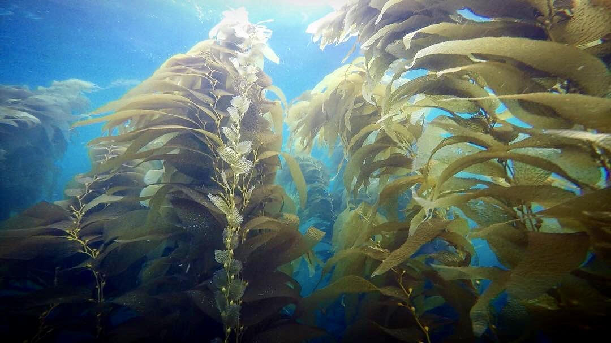

::: {#ppc}
Hello! I am a PhD [student](https://colsa.unh.edu/spotlight/maggie-dillon) in the [Jellison Lab](https://brittanyjellison.wixsite.com/research) at the University of New Hampshire studying the physiology and impact of farming practice on oysters over winter.

My research interests include quantitative marine research, fisheries, ecosystem based management, and anthropogenic effects on marine ecosystems research. I have a broad range of experiences in education, research, and policy work spanning both coasts of the United States, the Caribbean, and in remote and urban settings. I enjoy projects that couple science with outreach and community engagement.

**Education**

University of New Hampshire \| PhD in Marine Biology \| Durham, NH \| August 2025 - Current

California Polytechnic University, Pomona \| Master’s in Biology \| Pomona, CA \| August 2022 - May 2025

St. John’s College \| Bachelor of Arts \| Annapolis MD \| August 2014 - May 2018

To learn more about Quarto websites visit <https://quarto.org/docs/websites>.
:::
