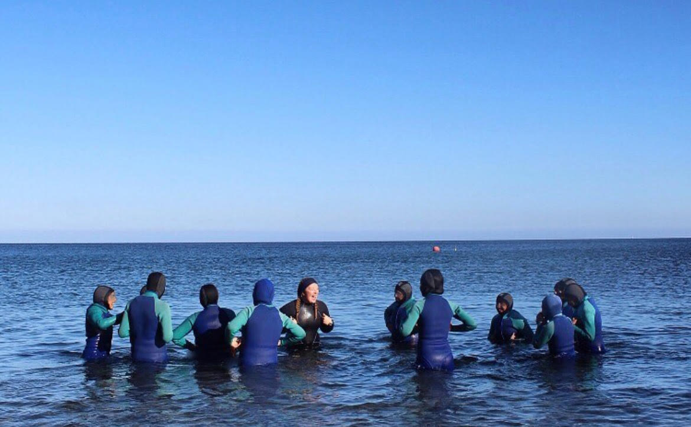
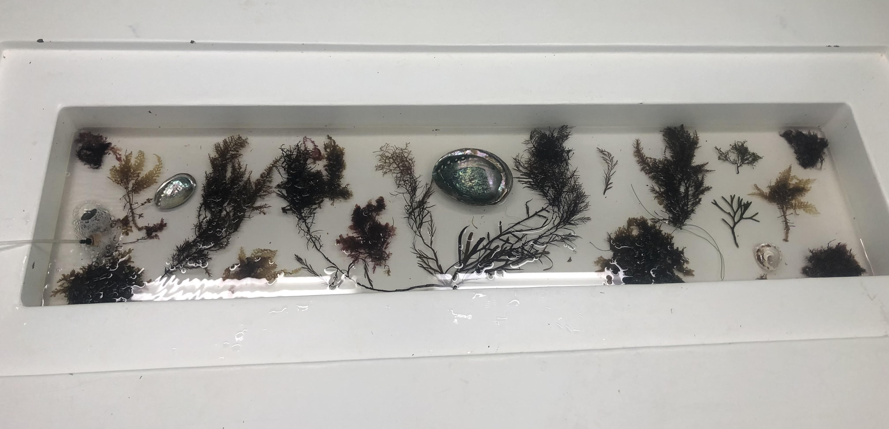

{fig-align="center"}

### In the News

[New England oyster are dying over the winter N.H. scientist are trying to figure out why](https://www.bostonglobe.com/2026/04/15/metro/new-hampshire-oysters-new-england-winter-die-off/)

[UNH Increasing New Hampshire’s Winter Oyster Survival](https://www.unh.edu/news/2026/04/increasing-new-hampshires-winter-oyster-survival)

### University of New Hampshire 

-   **Invited Judge** **University of New Hampshire Undergraduate Research Conference**

-   **Grant Reviewer Grassroot Fund:** Reviewed and scored grants for community projects

### Cal Poly Pomona

-   **PADI Open Water Instructor and Dive Master at the CPP ASI Dive Center (March 2024-August 2025)**: Taught Discover Scuba Dive and PADI Open Water Diver courses to CPP students

-   **President Biology Department Instructional Related Activities Committee (2024-2025)**: Processed purchase orders and disbursement requests for faculty members and biology department field courses

-   **President Biology Graduate Student Association (2023-2025)**: Served as a liaison between graduate students and the department and fostered an inclusive graduate student body

-   **TA BIO 1220 Foundations of Ecology (Fall 2022**): Introductory ecology course for bio majors.

###  Fellowships 

-   UC Davis NSF [Sustainable Oceans Traineeship](https://sustainableoceans.ucdavis.edu/person-type/sustainable-oceans-scholars-2023)

-   California State University [ARI Next Gen Fellowship](https://www.calstate.edu/impact-of-the-csu/research/ari)

-   California State University [Kenneth Coale Graduate Scholar Award](https://www.calstate.edu/impact-of-the-csu/research/coast/funding/Pages/student-funding.aspx)

-   California Polytechnic University, Pomona [Presidential Scholar](https://www.cpp.edu/president/honoring-excellence/maggie-dillon.shtml)

### Previous Teaching Experience

-   Marine Science Instructor [Catalina Island Marine Institute](https://cimi.org/)

-   Marine Program Lead Rustic Pathways Dominican Republic

{fig-align="center"}
