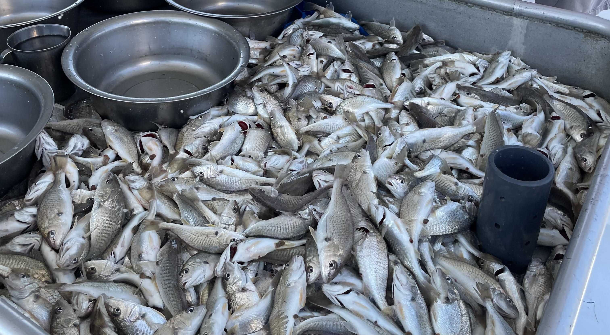
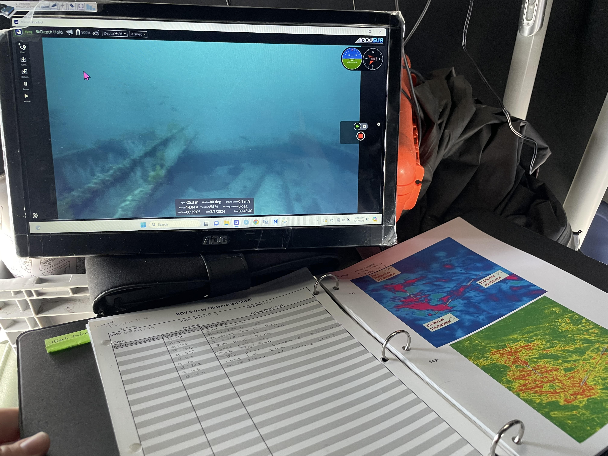
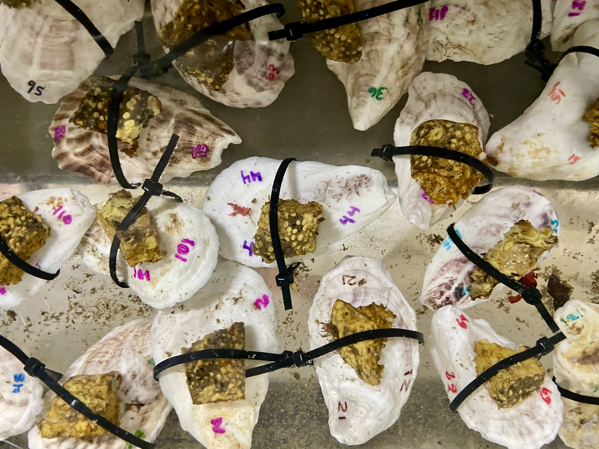
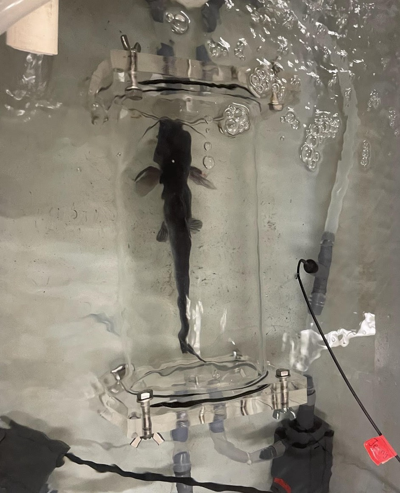
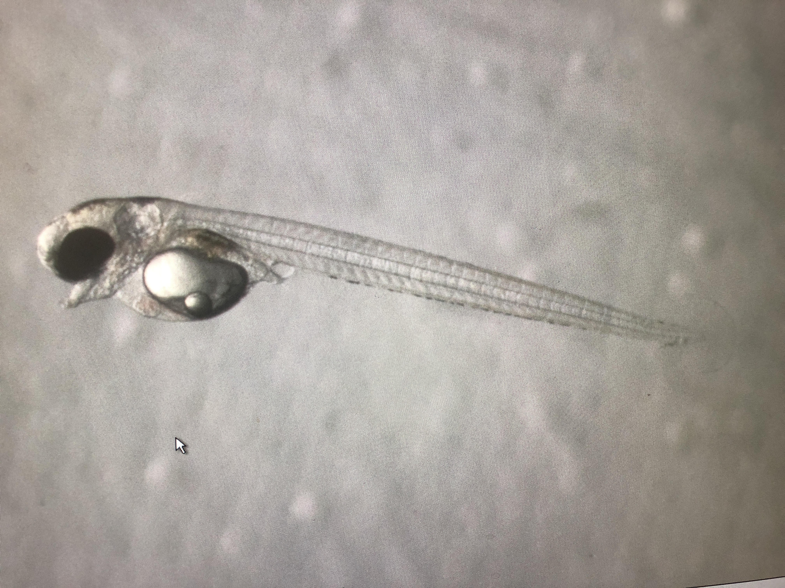

```{=html}
<style>
  @media (max-width: 768px) {
      .columns {
          display: block; /* Stack columns vertically on smaller screens */
      }
      .column {
          width: 100%; /* Full width for each column */
          margin-bottom: 20px; /* Space between stacked columns */
      }
      img {
          width: 100%; /* Ensure images take full width */
          height: auto; /* Maintain aspect ratio */
      }
  }
</style>
```

{fig-align="center"}

## Oyster in New England

::::: columns
::: column
### Oyster overwintering

Winter mortality is a significant challenge for eastern oyster (*Crassostrea virginica*) aquaculture operations in northern waters. Understanding how farming practices and physiological indicators associated with winter survival is critical for cold-weather oyster farming. We are studying the drivers of winter behavior and survival of eastern oysters in New Hampshire. For more details on our on going studies check out our methods here
:::

::: column
{width="100%"}
:::
:::::

## Artificial Reefs (ARs)

::::: columns
::: column
### **How does construction material and habitat metrics influence fish assemblages?**

My master thesis used remotely operated vehicles with stereo video cameras to survey artificial reefs in southern California. Construction materials, design, and habitat metrics can all influence fish assemblages. This project aimed to study size-specific assemblages. As more manmade substrate is added to waterways, policymakers need a better framework for evaluating projects. For more information check out the [Claisse Lab](https://www.claisselab.com/) and the California [Artificial Reef StoryMap](https://storymaps.arcgis.com/stories/d7ed6765a8a24449bfccf38643b4bdc0). For detailed methods on the habitiat and ROV data collcetion check out the [methods](https://storymaps.arcgis.com/stories/122e21f61c2a4eac966703816dd24dcc?header) section.
:::

::: column
{width="100%"}
:::
:::::

## Climate Change

::::: columns
::: column
### **How does ocean acidification affect erosion rates of boring sponges?**

In September 2024, I started as a research assistant in the [Stubler Lab](https://amberstubler.github.io/) at Occidental College. This is a one-year NSF-funded position conducting research on the effect of ocean acidification and predator presence on Boring Sponges (*Cliona celata*) and (*Cliona californiana*). In January 2025 the lab's microCT was installed and we are in the process of developing SOPs to utilize it in our research.
:::

::: column
{width="100%"}
:::
:::::

------------------------------------------------------------------------

::::: columns
::: column
### **How does temperature and salinity affect the metabolic processes of an invasive species?**

Blue catfish (*Ictalurus furcatus*) are an introduced species in the Chesapeake Bay. As a technician at the Virginia Institute of Marine Sciences in the Fabrizio Lab, I ran temperature and salinity metabolic rate experiments on blue catfish to aid managers in forecasting future range expansion for blue catfish.
:::

::: column
{width="100%"} <!-- Ensure full width on mobile -->
:::
:::::

------------------------------------------------------------------------

::::: columns
::: column
### **How does ocean warming affect the early life stages of fish?**

In the summer of 2018, I interned at the NOAA JJ Howard Marine Lab in Sandy Hook, New Jersey. We ran high-frequency flow-through experiments on the effects of ocean acidification, dissolved oxygen, and seasonal variation on the early life stages of Atlantic silverside (*Menidia menidia*).
:::

::: column
{width="100%"} <!-- Ensure full width on mobile -->
:::
:::::
